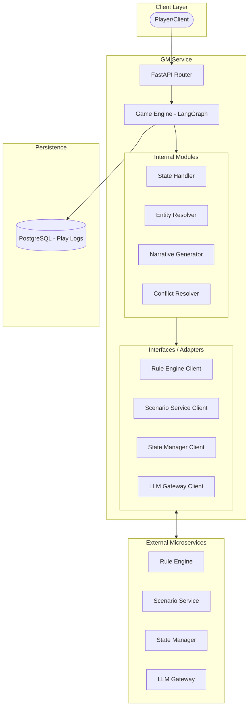
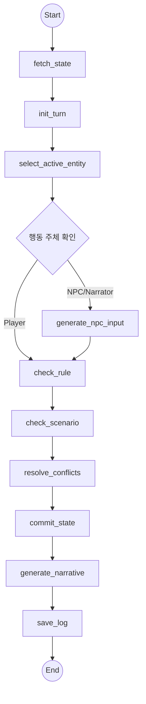

# GM Service Architecture

이 문서는 GM 서비스의 아키텍처 구조, 워크플로우 및 설계 장점을 설명합니다.

## 1. 아키텍처 구조도 (Architecture Diagram)

---

## 2. 전체 워크플로우 (Workflow)

GM 서비스는 **LangGraph** 기반의 상태 머신으로 동작하며, 하나의 턴(Turn)은 다음과 같은 순서로 처리됩니다.

### 2.1 LangGraph 노드 흐름도

### 2.2 상세 단계 설명

1.  **상태 조회 (`fetch_state`)**: State Manager로부터 현재 월드(위치, 엔티티, 상태) 스냅샷을 가져옵니다.
2.  **턴 초기화 (`init_turn`)**: 새로운 턴 ID를 생성하고 환경을 설정합니다.
3.  **주체 선정 (`select_active_entity`)**: 이번 턴에 행동할 주체(Player, NPC, 또는 Narrative)를 결정합니다.
4.  **행동 생성 (`generate_npc_input`)**: 행동 주체가 NPC인 경우, LLM을 통해 문맥에 맞는 행동과 대사를 생성합니다. (Player인 경우 사용자 입력을 사용)
5.  **룰 판정 (`check_rule`)**: 결정된 행동에 대해 Rule Engine에 성공 여부 및 스탯 변화(HP 감소 등) 판정을 요청합니다.
6.  **시나리오 확인 (`check_scenario`)**: Scenario Service에 스토리 흐름상의 이벤트 트리거 여부를 확인합니다.
7.  **충돌 해결 (`resolve_conflicts`)**: 시스템적 판정(Rule)과 서사적 강제(Scenario)를 병합하여 최종 상태 변경 사항(Diff)을 확정합니다.
8.  **상태 반영 (`commit_state`)**: 최종 변경 사항을 State Manager에 커밋하여 영속화합니다.
9.  **서사 생성 (`generate_narrative`)**: 확정된 결과와 상태 변화를 바탕으로 LLM이 풍부한 묘사(Narrative)를 생성합니다.
10. **로그 저장 (`save_log`)**: 모든 과정을 DB에 저장하여 세션 기록을 유지합니다.

---

## 3. 아키텍처의 장점

1.  **역할의 명확한 분리 (Decoupling)**:
    *   게임의 **논리(GM)**, **규칙(Rule)**, **스토리(Scenario)**, **데이터(State)**를 독립적인 마이크로서비스로 분리하여 각 서비스의 복잡도를 낮추고 독립적인 확장이 가능합니다.
2.  **제어 가능한 서사 생성 (Guided Narrative)**:
    *   LLM의 자유도에만 의존하지 않고, 결정론적인 Rule Engine과 Scenario Service의 결과를 먼저 도출한 뒤 이를 바탕으로 서사를 생성함으로써 '환각(Hallucination)' 현상을 방지하고 게임의 정합성을 유지합니다.
3.  **상태 머신 기반의 안정성 (LangGraph Orchestration)**:
    *   게임 루프를 LangGraph 상태 머신으로 관리함으로써, 복잡한 분기 로직(전투, 대화, 이벤트 등)을 구조적으로 파악하기 쉽고 각 단계별 재시도나 에러 처리가 용이합니다.
4.  **유연한 확장성**:
    *   새로운 게임 룰이나 시나리오 시스템을 도입할 때 GM 서비스의 코어 로직을 크게 수정하지 않고도 외부 서비스와의 인터페이스만 조정하여 기능을 확장할 수 있습니다.
5.  **신뢰성 있는 로그 및 추적**:
    *   모든 턴의 결정 과정(판정 근거, 상태 변화 등)을 상세히 로깅하여 문제 발생 시 추적성을 확보하고 리플레이 기능을 구현하기에 유리합니다.
