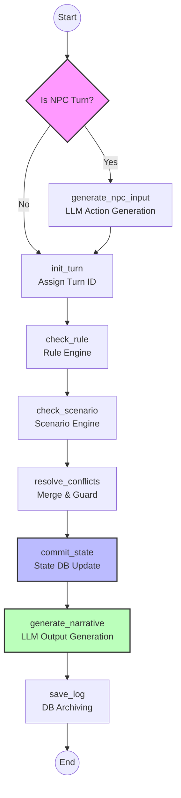

# GM Core Architecture

## 1. Turn Processing Workflow (LangGraph)

GM 서비스의 핵심 로직은 LangGraph 기반의 상태 머신으로 구현되어 있습니다. 플레이어 입력과 NPC 행동 모두 동일한 파이프라인을 통해 처리됩니다.

> **Note**: 실제 구현상 `generate_npc_input` 노드 내부에서 `is_npc_turn`을 체크하여 동작 여부를 결정하지만, 논리적 흐름은 위와 같습니다.

---

## 2. State Management (TurnContext)

파이프라인의 각 단계는 공유 상태 객체인 `TurnContext`를 업데이트하며 진행됩니다.

### **Initial State**

- **Input**: `session_id`, `user_input` (Player의 경우), `is_npc_turn`

### **Step-by-Step Updates**

| Node / Step            | Role                                                 | Updates in Context                       |
| :--------------------- | :--------------------------------------------------- | :--------------------------------------- |
| **generate_npc_input** | NPC 턴일 경우 LLM을 통해 행동 텍스트 생성            | `user_input` (NPC Action)                |
| **init_turn**          | 세션 로그를 조회하여 고유 Turn ID 발급               | `turn_seq`, `turn_id`                    |
| **check_rule**         | 사용자 입력을 룰 엔진에 질의하여 판정 결과 수신      | `rule_outcome` (Success/Fail, Diffs)     |
| **check_scenario**     | 시나리오 진행 상황 및 제약 조건 확인                 | `scenario_suggestion` (Correction Diffs) |
| **resolve_conflicts**  | Rule과 Scenario의 제안을 취합하고 우선순위 적용      | `final_diffs` (Merged Entity Diffs)      |
| **commit_state**       | 최종 변경사항을 State Manager에 반영 (단일 트랜잭션) | `commit_id`                              |
| **generate_narrative** | 확정된 결과와 커밋 ID를 기반으로 서술 텍스트 생성    | `narrative`                              |
| **save_log**           | 전체 처리 과정과 결과를 PlayLog DB에 영구 저장       | (Side Effect: DB Insert)                 |

---

## 3. External Dependencies

- **Rule Manager**: `POST /api/v1/rule/check`
- **Scenario Manager**: `POST /api/v1/scenario/check`
- **State Manager**: `POST /api/v1/state/commit`
- **LLM Gateway**:
  - `POST /api/v1/llm/narrative`
  - `POST /api/v1/llm/npc-action`
